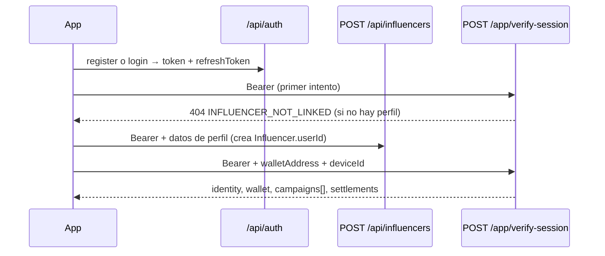

# App influencer: autenticación (obtener y mantener el JWT)

Cómo la **app móvil** autentica al influencer **antes** de usar las rutas `/api/influencers/app/*`
(identidad, wallet, campañas, story cards y abonos/monetización).

> Modelo mental:
> - **Cuenta (`User`)** → maneja el login y el **JWT**. Vive en `/api/auth/*`.
> - **Perfil de influencer (`Influencer`)** → es un recurso ligado a la cuenta por `Influencer.userId`.
>   Las rutas `/api/influencers/app/*` exigen que **exista** ese perfil (si no, responden `INFLUENCER_NOT_LINKED`).

Base URL: `{API_ORIGIN}` — producción: `https://www.damecodigo.com`

Autenticación: **Bearer JWT** en el header `Authorization: Bearer <access_token>`.

Vigencia del token: **24 h** (access y refresh). Renovar con `POST /api/auth/refresh`.

---

## Resumen de endpoints de auth

| Método | Ruta | Uso en app |
|--------|------|------------|
| `POST` | `/api/auth/register` | Crear cuenta (idealmente con `primaryRole: "influencer"`) |
| `POST` | `/api/auth/login` | Iniciar sesión con **email o teléfono** + contraseña |
| `POST` | `/api/auth/refresh` | Renovar `token` y `refreshToken` (cuando expira el access) |
| `GET`  | `/api/auth/me` | Datos de la cuenta logueada |
| `POST` | `/api/auth/logout` | Invalidar el `refreshToken` en el servidor |
| `POST` | `/api/auth/change-password` | Cambiar contraseña (con sesión activa) |
| `POST` | `/api/auth/password-reset/request` | Pedir OTP por **SMS** (recuperación por teléfono) |
| `POST` | `/api/auth/password-reset/verify` | Validar OTP → devuelve `resetToken` |
| `POST` | `/api/auth/password-reset/confirm` | Fijar nueva contraseña con `resetToken` |

Tras obtener el token, continúa con [APP_INFLUENCER_IDENTITY_AND_STORY_CARDS.md](./APP_INFLUENCER_IDENTITY_AND_STORY_CARDS.md)
(`POST /api/influencers/app/verify-session`).

---

## 0) Endpoints dedicados de influencer (recomendado para la app)

Para la app conviene usar los endpoints **específicos de influencer**: en una sola llamada crean la
cuenta **y** el perfil de influencer (o lo garantizan al iniciar sesión) y devuelven directamente la
**sesión de influencer** (`influencer`) además del `token` / `refreshToken`.

| Método | Ruta | Qué hace |
|--------|------|----------|
| `POST` | `/api/influencers/app/auth/enter` | **Acceso directo (app):** si la cuenta existe inicia sesión; si no, la crea y la da de alta como influencer. Un solo endpoint. |
| `POST` | `/api/influencers/app/auth/register` | Crea usuario `primaryRole=influencer` + perfil + devuelve token y sesión |
| `POST` | `/api/influencers/app/auth/login` | Login (email/teléfono) + garantiza perfil + devuelve token y sesión |

### `POST /api/influencers/app/auth/enter` (recomendado para la app)

El usuario entra **directo**: con una sola llamada se valida (login) o se da de alta como influencer.

```json
{ "login": "creador@ejemplo.com", "password": "MiClave123" }
```

- `login` acepta **email o teléfono** (también puedes mandar `email` o `phone` por separado).
- Si la cuenta **existe** → valida la contraseña e inicia sesión.
- Si **no existe** → crea la cuenta (`primaryRole=influencer`), su perfil y la da de alta.
  - En este caso la contraseña debe cumplir: mín. 8, mayúscula, minúscula y número.
- Opcionales para enriquecer el alta: `firstName`, `lastName`, `name`, `username`, `socialMedia`.

**Respuesta** → `{ success, created, token, refreshToken, user, influencer }`

| Campo | Significado |
|-------|-------------|
| `created` | `true` si se dio de alta una cuenta nueva; `false` si fue login |
| `influencer` | Sesión completa (igual que `verify-session`) |
| HTTP | `201` si se creó, `200` si fue login |

| HTTP | Cuándo |
|------|--------|
| 400 | Falta credencial/contraseña o contraseña débil (en alta nueva) |
| 401 | Cuenta existente con contraseña incorrecta |
| 423 | Cuenta bloqueada temporalmente |

Página web lista para webview / pruebas: **`/influencer/auth`** (`?mode=register` y `?next=/ruta`).

### `POST /api/influencers/app/auth/register`

| Campo | Tipo | Obligatorio | Descripción |
|-------|------|-------------|-------------|
| `email` | string | Email **o** teléfono | Correo. |
| `phone` | string | Email **o** teléfono | WhatsApp/teléfono. |
| `password` | string | Sí | Mín. 8, con mayúscula, minúscula y número. |
| `firstName` | string | Sí (o `name`) | Nombre. |
| `lastName` | string | No | Apellido. |
| `name` | string | No | Alternativa a `firstName`+`lastName` para el perfil. |
| `username` | string | No | Handle del influencer (si no, se deriva de IG/nombre). |
| `socialMedia` | object | No | `{ instagram, tiktok, ... }`. |
| `categories` / `languages` / `bio` / `location` / `avatar` | — | No | Datos opcionales de perfil. |

```json
{
  "email": "creador@ejemplo.com",
  "password": "MiClave123",
  "firstName": "María",
  "lastName": "López",
  "username": "marialopez",
  "socialMedia": { "instagram": "marialopez" }
}
```

**Respuesta 201** → `{ success, token, refreshToken, user, influencer }`
donde `influencer` es la **misma sesión** que devuelve `verify-session` (identity, wallet, campaigns, settlements).

| HTTP | `code` | Cuándo |
|------|--------|--------|
| 400 | — | Falta email/teléfono, contraseña débil o sin nombre |
| 409 | `EMAIL_TAKEN` / `PHONE_TAKEN` | La cuenta ya existe → usar login |

### `POST /api/influencers/app/auth/login`

```json
{ "login": "creador@ejemplo.com", "password": "MiClave123" }
```

`login` acepta **email o teléfono**. Devuelve `{ success, token, refreshToken, user, influencer }`.
Si la cuenta no tenía perfil de influencer, **se crea automáticamente** (queda `identityVerificationStatus: pending`).

| HTTP | Cuándo |
|------|--------|
| 400 | Falta `login`/`password` |
| 401 | Credenciales inválidas |
| 423 | Cuenta bloqueada temporalmente |

> Estos endpoints comparten el mismo `JWT` que `/api/auth/*`: el `token` sirve para todas las rutas
> `/api/influencers/app/*` y se renueva con `POST /api/auth/refresh`.

---

## 1) Registro

### `POST /api/auth/register`

**Body (JSON)**

| Campo | Tipo | Obligatorio | Descripción |
|-------|------|-------------|-------------|
| `email` | string | Email **o** teléfono | Correo válido. |
| `phone` | string | Email **o** teléfono | WhatsApp/teléfono (10–20 caracteres). |
| `password` | string | Sí | Mín. 8, con **mayúscula, minúscula y número**. |
| `firstName` | string | Sí | 2–50 caracteres. |
| `lastName` | string | Sí | 2–50 caracteres. |
| `primaryRole` | string | No | `user` (default) \| `influencer` \| `brand` \| `agency`. Para la app usa `influencer`. |

```json
{
  "email": "creador@ejemplo.com",
  "password": "MiClave123",
  "firstName": "María",
  "lastName": "López",
  "primaryRole": "influencer"
}
```

**Respuesta 201**

```json
{
  "message": "Usuario registrado exitosamente",
  "user": {
    "id": "64abc...",
    "email": "creador@ejemplo.com",
    "phone": null,
    "firstName": "María",
    "lastName": "López",
    "primaryRole": "influencer",
    "isSuperAdmin": false,
    "profileTypes": ["influencer"],
    "isVerified": false
  },
  "token": "<access_token>",
  "refreshToken": "<refresh_token>"
}
```

**Errores**

| HTTP | Cuándo |
|------|--------|
| 400 | Datos inválidos (password débil, falta email y teléfono, nombre corto) |
| 409 | Ya existe usuario con ese email o teléfono |

> El registro **no** crea el perfil de influencer. Eso se hace luego con `POST /api/influencers`
> (ver §6 "Onboarding completo").

---

## 2) Login

### `POST /api/auth/login`

Acepta **email o teléfono** en el campo `login` (también se acepta `email` por compatibilidad).

**Body (JSON)**

| Campo | Tipo | Obligatorio | Descripción |
|-------|------|-------------|-------------|
| `login` | string | Sí | Email (contiene `@`) **o** teléfono/WhatsApp. |
| `password` | string | Sí | Contraseña. |

```json
{ "login": "creador@ejemplo.com", "password": "MiClave123" }
```

```json
{ "login": "+5215512345678", "password": "MiClave123" }
```

**Respuesta 200**

```json
{
  "message": "Inicio de sesión exitoso",
  "user": {
    "id": "64abc...",
    "email": "creador@ejemplo.com",
    "phone": null,
    "firstName": "María",
    "lastName": "López",
    "primaryRole": "influencer",
    "isSuperAdmin": false,
    "profileTypes": ["influencer"],
    "roles": [{ "id": "...", "name": "user", "displayName": "Usuario", "level": 1 }],
    "isVerified": false
  },
  "token": "<access_token>",
  "refreshToken": "<refresh_token>"
}
```

**Errores**

| HTTP | Cuándo |
|------|--------|
| 400 | Falta `login`/`password` o teléfono inválido |
| 401 | Credenciales inválidas |
| 423 | Cuenta bloqueada por intentos fallidos (reintenta luego) |
| 409 | Varias cuentas comparten ese teléfono → inicia sesión con email |

La app debe **guardar de forma segura** `token` y `refreshToken` (Keychain / Keystore).

---

## 3) Renovar token

### `POST /api/auth/refresh`

Cuando una llamada responde `401` por token expirado, renueva sin pedir contraseña.

**Body**

```json
{ "refreshToken": "<refresh_token>" }
```

**Respuesta 200**

```json
{
  "message": "Token renovado exitosamente",
  "token": "<nuevo_access_token>",
  "refreshToken": "<nuevo_refresh_token>"
}
```

**Errores**

| HTTP | Cuándo |
|------|--------|
| 400 | Falta `refreshToken` |
| 401 | `refreshToken` expirado → volver a `login` |
| 403 | `refreshToken` inválido o ya rotado |

> El servidor **rota** el refresh token: guarda siempre el nuevo `refreshToken` que devuelve.

---

## 4) Cuenta logueada

### `GET /api/auth/me`

Header: `Authorization: Bearer <access_token>`

**Respuesta 200** → `{ "user": { ...perfil de cuenta, settings, stats... } }`

Útil para refrescar nombre/rol al abrir la app. **No** trae el perfil de influencer
(para eso usa `GET /api/influencers/me` o `POST /app/verify-session`).

---

## 5) Contraseña

### `POST /api/auth/change-password` (con sesión)

```json
{ "currentPassword": "MiClave123", "newPassword": "MiClaveNueva456" }
```

| HTTP | Cuándo |
|------|--------|
| 200 | Cambiada |
| 400 | Contraseña actual incorrecta o nueva no cumple reglas |

### Recuperación por SMS (sin sesión)

Flujo de 3 pasos por teléfono:

1. **`POST /api/auth/password-reset/request`** → `{ "phone": "+5215512345678" }`
   - Siempre responde `200` con mensaje neutro (no revela si el número existe).
   - En **desarrollo** o sin Twilio configurado, devuelve `debugOtp` para QA.
2. **`POST /api/auth/password-reset/verify`** → `{ "phone": "...", "otp": "123456" }`
   - Respuesta: `{ "success": true, "resetToken": "<jwt 15 min>" }`
3. **`POST /api/auth/password-reset/confirm`** → `{ "resetToken": "...", "newPassword": "MiClaveNueva456" }`

| HTTP | Cuándo |
|------|--------|
| 400 | Teléfono/OTP inválido o contraseña débil |
| 429 | Demasiados intentos de OTP |
| 401/403 | `resetToken` expirado o no verificado |

---

## 6) Onboarding completo del influencer en la app



**Pasos**

1. `register` (con `primaryRole: "influencer"`) **o** `login`. Guardar `token` + `refreshToken`.
2. Llamar `POST /api/influencers/app/verify-session`.
   - Si responde **404 `INFLUENCER_NOT_LINKED`**, el usuario aún no tiene perfil de influencer.
3. Crear el perfil: **`POST /api/influencers`** con `Authorization: Bearer <token>`
   (el backend vincula `Influencer.userId` automáticamente con la sesión).

   ```json
   { "name": "María López", "username": "marialopez", "bio": "...", "socialMedia": { "instagram": "marialopez" } }
   ```
4. (Opcional pero recomendado) Subir evidencia de identidad:
   `POST /api/influencers/app/verification-screenshot` (multipart, campo `image`).
5. Un **super admin** confirma la identidad en `/admin/crm`.
6. Volver a `POST /app/verify-session`: ya con `dashboardAccess: true`, campañas y monetización activas.

> El **perfil público** (`/influencer/:slug`) es visible aunque la identidad esté `pending`.
> El **dashboard de la app** (campañas + abonos) requiere `identityVerificationStatus === 'approved'`.

---

## 7) Manejo del 401 en el cliente (TypeScript)

```ts
const API = 'https://www.damecodigo.com';
let accessToken = '';      // cargar de almacenamiento seguro
let refreshToken = '';

async function authedFetch(path: string, init: RequestInit = {}): Promise<Response> {
  const withAuth = (t: string): RequestInit => ({
    ...init,
    headers: { ...(init.headers || {}), Authorization: `Bearer ${t}`, Accept: 'application/json' },
  });

  let res = await fetch(`${API}${path}`, withAuth(accessToken));
  if (res.status !== 401) return res;

  // Intentar refrescar una vez
  const r = await fetch(`${API}/api/auth/refresh`, {
    method: 'POST',
    headers: { 'Content-Type': 'application/json' },
    body: JSON.stringify({ refreshToken }),
  });
  if (!r.ok) throw new Error('SESSION_EXPIRED'); // → enviar a login
  const data = await r.json();
  accessToken = data.token;
  refreshToken = data.refreshToken; // ⚠️ el refresh rota: guardar el nuevo
  // persistir accessToken/refreshToken…

  return fetch(`${API}${path}`, withAuth(accessToken));
}

async function login(login: string, password: string) {
  const res = await fetch(`${API}/api/auth/login`, {
    method: 'POST',
    headers: { 'Content-Type': 'application/json' },
    body: JSON.stringify({ login, password }),
  });
  if (!res.ok) throw new Error((await res.json().catch(() => ({}))).message || `login ${res.status}`);
  const data = await res.json();
  accessToken = data.token;
  refreshToken = data.refreshToken;
  return data.user;
}
```

---

## 8) Pruebas rápidas (curl)

```bash
API="https://www.damecodigo.com"

# Login (email o teléfono en "login")
curl -sS -X POST "$API/api/auth/login" \
  -H "Content-Type: application/json" \
  -d '{"login":"creador@ejemplo.com","password":"MiClave123"}' | jq '{token, refreshToken, user}'

TOKEN="<access_token>"

# Cuenta logueada
curl -sS "$API/api/auth/me" -H "Authorization: Bearer $TOKEN" | jq .user

# Sesión de influencer (sigue en el doc de identidad)
curl -sS -X POST "$API/api/influencers/app/verify-session" \
  -H "Authorization: Bearer $TOKEN" -H "Content-Type: application/json" \
  -d '{"deviceId":"test-1"}' | jq '{dashboardAccess, identity, totalCampaigns}'
```

---

## 9) Código fuente (referencia)

| Pieza | Archivo |
|-------|---------|
| Rutas auth | `server/routes/auth.js` |
| Middleware JWT (`authenticateToken`, `optionalAuth`) | `server/middleware/jwtAuth.js` |
| Modelo de cuenta | `server/models/User.js` |
| OTP recuperación (SMS) | `server/models/PasswordResetOtp.js`, `server/utils/twilioSms.js` |
| Perfil influencer (crear / me) | `server/controllers/influencerController.js` |
| Sesión app influencer | `server/controllers/influencerAppController.js`, `server/utils/influencerAppSession.js` |

---

## 10) Documentos relacionados

- [APP_INFLUENCER_IDENTITY_AND_STORY_CARDS.md](./APP_INFLUENCER_IDENTITY_AND_STORY_CARDS.md) — identidad, wallet, campañas, story cards.
- [INFLUENCER_TOKEN_SETTLEMENT_MONGO.md](./INFLUENCER_TOKEN_SETTLEMENT_MONGO.md) — monetización (abonos por canje).
