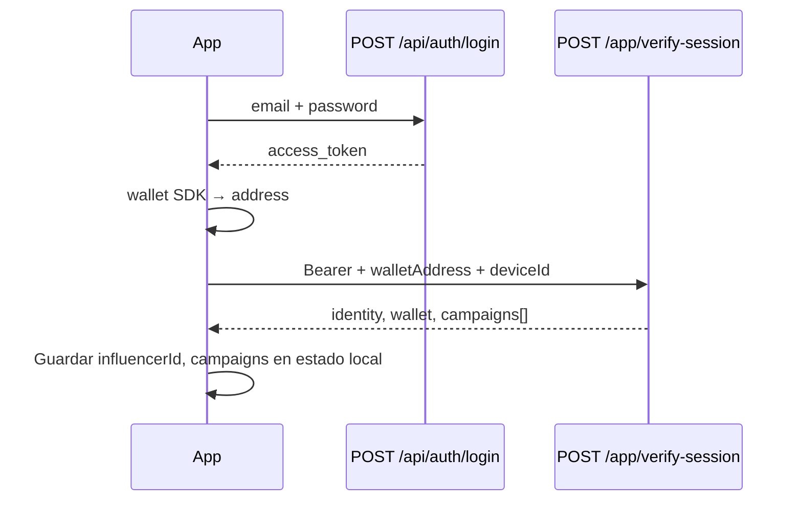

# App influencer: identidad, wallet y story cards (Nano Banana)

Documento para implementar en la **app móvil** el flujo de:

1. Validar que el usuario logueado es un **influencer** vinculado.
2. Leer / sincronizar la **wallet** que la app expone (WalletConnect, MetaMask in-app, etc.).
3. Listar **campañas** con código corto, descuento y datos para cupones QR.
4. Generar **imágenes verticales 9:16** (historias) con código corto + % de descuento vía **Nano Banana** (Gemini Image).

Base URL: `{API_ORIGIN}/api/influencers`

Autenticación: **Bearer JWT** (mismo token que `POST /api/auth/login` / sesión web).

---

## Resumen de endpoints

| Método | Ruta | Uso en app |
|--------|------|------------|
| `POST` | `/app/verify-session` | Tras login: validar influencer + wallet + campañas en una llamada |
| `PATCH` | `/app/wallet` | Solo actualizar wallet sin re-listar todo |
| `GET` | `/app/campaigns` | Refrescar listado de campañas activas |
| `POST` | `/app/story-cards` | Story vertical con código + % (Nano Banana en servidor o prompt para cliente) |
| `POST` | `/app/verification-screenshot` | Subir evidencia (screenshot del perfil) para verificación super admin |
| `GET` | `/app/settlements/summary` | Resumen abonos pending/paid por campaña |
| `GET` | `/app/settlements` | Listado de abonos (ledger Mongo) |
| `POST` | `/app/settlements/process-pending` | Marcar pending → paid (requiere wallet) |

**Abonos por canje (tokens/comisión):** [INFLUENCER_TOKEN_SETTLEMENT_MONGO.md](./INFLUENCER_TOKEN_SETTLEMENT_MONGO.md)

Rate limit: **60 peticiones / 15 min / IP** (mismo bucket en las rutas `/app/*`).

---

## 1) Validar identidad y recuperar wallet + campañas

### `POST /api/influencers/app/verify-session`

**Headers**

```http
Authorization: Bearer <access_token>
Content-Type: application/json
Accept: application/json
```

**Body (JSON)**

| Campo | Tipo | Obligatorio | Descripción |
|-------|------|-------------|-------------|
| `walletAddress` | string | No | Dirección desde la app (`0x…` EVM u otra cadena válida). Si viene, se guarda en `User` y `UserProfile`. |
| `wallet` | string | No | Alias de `walletAddress`. |
| `preferredNetwork` | string | No | Ej. `ethereum`, `polygon`, `bsc`, `avalanche`. |
| `blockchain` | string | No | Alias de `preferredNetwork`. |
| `syncWallet` | boolean | No | Default `true`. Si `false`, solo lee wallet guardada sin sobrescribir. |
| `deviceId` | string | No | Id estable del dispositivo (auditoría / logs; no persiste en esta versión). |

**Ejemplo**

```json
{
  "walletAddress": "0x742d35Cc6634C0532925a3b844Bc9e7595f0bEb",
  "preferredNetwork": "polygon",
  "deviceId": "app-install-uuid-v1"
}
```

**Respuesta 200**

El perfil público del influencer **siempre** se devuelve si existe `userId` en `influencers`. El acceso al **dashboard** (campañas, abonos) depende de `identityVerificationStatus === 'approved'` (confirmado por super admin en CRM).

| Campo | Significado |
|-------|-------------|
| `dashboardAccess` | `true` si el super admin confirmó identidad |
| `verified` | Igual que `dashboardAccess` (compatibilidad) |
| `identityVerificationStatus` | `pending` \| `approved` \| `rejected` |
| `campaigns` | Vacío si `dashboardAccess` es `false` |
| `accessMessage` | Texto para mostrar en app si aún no hay acceso |

```json
{
  "success": true,
  "ok": true,
  "verified": true,
  "dashboardAccess": true,
  "identityVerificationStatus": "approved",
  "identity": {
    "userId": "64abc...",
    "email": "creador@ejemplo.com",
    "influencerId": "64def...",
    "influencerStatus": "active",
    "identityVerificationStatus": "approved"
  },
  "wallet": {
    "address": "0x742d35Cc6634C0532925a3b844Bc9e7595f0bEb",
    "preferredNetwork": "polygon",
    "source": "app",
    "syncedFromApp": true
  },
  "influencer": {
    "id": "64def...",
    "name": "María López",
    "username": "marialopez",
    "avatar": "https://...",
    "status": "active",
    "userId": "64abc..."
  },
  "influencerProfileShortCode": "HESMRAUW",
  "campaigns": [
    {
      "shortCode": "K7HN4P2",
      "label": "Campaña TikTok marzo",
      "referralPrefix": "L4D",
      "referralCode": "L4D-K7HN4P2",
      "expiresAt": null,
      "canIssueCoupon": true,
      "issueMode": "qr",
      "discountPercentage": 20,
      "promotion": {
        "id": "64promo...",
        "title": "50% en cafés",
        "brand": "Café Central",
        "image": "/uploads/promotions/....webp",
        "status": "active",
        "validUntil": "2026-12-31T06:00:00.000Z",
        "redirectInsteadOfQr": false
      }
    }
  ],
  "totalCampaigns": 1,
  "settlements": {
    "enabled": true,
    "transferMethod": "mongo_ledger",
    "tokenSymbol": "LUXAE",
    "payoutWallet": "0x742d35Cc6634C0532925a3b844Bc9e7595f0bEb",
    "payoutWalletRequired": false,
    "summary": {
      "pendingCount": 0,
      "pendingAmountUsd": 0,
      "paidCount": 3,
      "paidAmountUsd": 3.6,
      "byPromotion": []
    }
  },
  "verifiedAt": "2026-05-19T12:00:00.000Z",
  "deviceId": "app-install-uuid-v1"
}
```

Cada ítem de `campaigns[]` puede incluir `settlement` con comisión por canje y totales pending/paid de esa promoción (ver doc de settlement).

**Errores**

| HTTP | `code` | Cuándo |
|------|--------|--------|
| 401 | — | Sin token o token inválido |
| 400 | `INVALID_WALLET` | `walletAddress` con formato no aceptado |
| 404 | `INFLUENCER_NOT_LINKED` | Usuario sin fila en `influencers` (`userId`) |
| 403 | `INFLUENCER_IDENTITY_NOT_APPROVED` | Solo en rutas `/app/settlements/*` si identidad no aprobada |
| 503 | — | MongoDB no conectado |
| 429 | — | Rate limit |

### Verificación de identidad (onboarding app)

1. `POST /api/analyze-profile-image` — extraer datos del screenshot del perfil social.
2. `POST /api/influencers` — crear perfil (`identityVerificationStatus: pending`, perfil público visible).
3. `POST /api/influencers/app/verification-screenshot` — subir evidencia (`crm.verification.screenshotUrl`).
4. Super admin en **`/admin/crm`** → **Confirmar identidad** (`POST /api/admin/crm/influencers/:id/identity-verification`).
5. `POST /app/verify-session` — con `dashboardAccess: true`, campañas y settlements activos.

**Flujo recomendado en app**



---

## 2) Solo actualizar wallet

### `PATCH /api/influencers/app/wallet`

**Body**

```json
{
  "walletAddress": "0x742d35Cc6634C0532925a3b844Bc9e7595f0bEb",
  "preferredNetwork": "polygon"
}
```

**Respuesta 200**

```json
{
  "ok": true,
  "success": true,
  "influencerId": "64def...",
  "wallet": {
    "address": "0x742d35Cc6634C0532925a3b844Bc9e7595f0bEb",
    "preferredNetwork": "polygon",
    "source": "app"
  },
  "updatedAt": "2026-05-19T12:05:00.000Z"
}
```

Usar cuando el usuario **cambia de cuenta** en la wallet de la app sin necesidad de volver a cargar campañas.

---

## 3) Listar campañas (atajo)

### `GET /api/influencers/app/campaigns`

Misma forma de `campaigns`, `influencer`, `influencerProfileShortCode` que en `verify-session`, sin tocar wallet.

Útil para **pull-to-refresh** en la pantalla “Mis promociones”.

---

## 4) Story vertical: código corto + % (Nano Banana)

### `POST /api/influencers/app/story-cards`

Genera una imagen **9:16** (1080×1920) con el **código corto** y el **porcentaje de descuento** de una campaña del influencer.

**Backend:** usa **Gemini Image** (comunidad: *Nano Banana*), modelo por defecto `gemini-2.5-flash-image`.

Variables de entorno (servidor):

| Variable | Descripción |
|----------|-------------|
| `GEMINI_API_KEY` o `gemini-api-key` | Misma clave que análisis de promociones |
| `GEMINI_STORY_CARD_MODEL` | Opcional; default `gemini-2.5-flash-image` |
| `GEMINI_NANO_BANANA_MODEL` | Alias del anterior |

**Body**

| Campo | Tipo | Obligatorio | Descripción |
|-------|------|-------------|-------------|
| `promotionId` | string | Uno de dos | `ObjectId` de la promoción |
| `shortCode` / `code` | string | Uno de dos | Código corto de la fila `influencer_promo_short_codes` |

**Ejemplo**

```json
{
  "shortCode": "K7HN4P2"
}
```

**Respuesta 200 (imagen generada en servidor)**

```json
{
  "success": true,
  "ok": true,
  "format": "vertical_phone",
  "aspectRatio": "9:16",
  "width": 1080,
  "height": 1920,
  "shortCode": "K7HN4P2",
  "referralCode": "L4D-K7HN4P2",
  "discountPercentage": 20,
  "promotion": {
    "id": "64promo...",
    "title": "50% en cafés",
    "brand": "Café Central",
    "image": "/uploads/promotions/....webp"
  },
  "nanoBanana": {
    "model": "gemini-2.5-flash-image",
    "generated": true,
    "prompt": "Create a vertical smartphone story image...",
    "message": null
  },
  "image": {
    "filename": "story-1779166000000-a1b2.png",
    "url": "/uploads/story-cards/story-1779166000000-a1b2.png",
    "mimeType": "image/png",
    "width": 1080,
    "height": 1920
  },
  "promptForClient": null
}
```

**Respuesta 200 (sin API key o fallo de generación)**

```json
{
  "nanoBanana": {
    "model": "gemini-2.5-flash-image",
    "generated": false,
    "prompt": "...",
    "message": "GEMINI_API_KEY no configurada; usa prompt en cliente o configura servidor"
  },
  "image": null,
  "promptForClient": "Create a vertical smartphone story image..."
}
```

En ese caso la app puede llamar **directamente** a la API de Gemini Image con `promptForClient` (mismo modelo Nano Banana).

**URL pública de la imagen**

```text
{API_ORIGIN}{image.url}
```

Ejemplo: `https://www.damecodigo.com/uploads/story-cards/story-....png`

**Errores**

| HTTP | `code` | Cuándo |
|------|--------|--------|
| 404 | `CAMPAIGN_NOT_FOUND` | `shortCode` / `promotionId` no pertenece al influencer o inactivo |
| 401 | — | Sin JWT |

---

## 5) Relación con códigos cortos y cupones QR

| Concepto | Dónde |
|----------|--------|
| Código corto de campaña | `campaigns[].shortCode` |
| Emitir cupón desde código | `POST /api/discount-qr/codes/:code/issue` — ver [APP_SHORT_PROMO_CODES.md](./APP_SHORT_PROMO_CODES.md) |
| `referralCode` sugerido | `campaigns[].referralCode` (`L4D-CODIGO`) |
| `walletAddress` al crear QR | Usar `wallet.address` de `verify-session` en `POST /api/discount-qr/create` |
| Abono tras canje | Automático: `influencer_token_settlements` — ver [INFLUENCER_TOKEN_SETTLEMENT_MONGO.md](./INFLUENCER_TOKEN_SETTLEMENT_MONGO.md) |

Ejemplo encadenado en app:

```ts
const session = await post('/api/influencers/app/verify-session', {
  walletAddress: await wallet.getAddress(),
  deviceId,
});

const campaign = session.campaigns[0];
const story = await post('/api/influencers/app/story-cards', {
  shortCode: campaign.shortCode,
});

// Compartir story.image.url o generar local con story.promptForClient

const issue = await post(`/api/discount-qr/codes/${campaign.shortCode}/issue`, {
  deviceId,
});
// issue.qrValue → mostrar QR
```

---

## 6) Implementación cliente (TypeScript)

```ts
const API = 'https://www.damecodigo.com';

async function influencerAppBootstrap(accessToken: string, walletAddress: string, deviceId: string) {
  const res = await fetch(`${API}/api/influencers/app/verify-session`, {
    method: 'POST',
    headers: {
      Authorization: `Bearer ${accessToken}`,
      'Content-Type': 'application/json',
      Accept: 'application/json',
    },
    body: JSON.stringify({ walletAddress, deviceId, preferredNetwork: 'polygon' }),
  });
  if (!res.ok) {
    const err = await res.json().catch(() => ({}));
    throw new Error(err.message || `verify-session ${res.status}`);
  }
  return res.json();
}

async function generateStoryCard(accessToken: string, shortCode: string) {
  const res = await fetch(`${API}/api/influencers/app/story-cards`, {
    method: 'POST',
    headers: {
      Authorization: `Bearer ${accessToken}`,
      'Content-Type': 'application/json',
    },
    body: JSON.stringify({ shortCode }),
  });
  return res.json();
}
```

---

## 7) Checklist servidor (producción)

- [ ] `GEMINI_API_KEY` en `.env` del VPS para story cards en servidor.
- [ ] Carpeta `server/uploads/story-cards` escribible (se crea sola; servida bajo `/uploads/story-cards/`).
- [ ] Influencer con `userId` vinculado al usuario que hace login en la app.
- [ ] Filas activas en `influencer_promo_short_codes` (backfill o aprobación de aplicaciones).
- [ ] PM2 + Nginx con proxy `/api/` (ver [NGINX_DAMECODIGO_CONF.md](../NGINX_DAMECODIGO_CONF.md)).

---

## 8) Código fuente (referencia)

| Pieza | Archivo |
|-------|---------|
| Rutas | `server/routes/influencers.js` |
| Controlador | `server/controllers/influencerAppController.js` |
| Sesión + campañas | `server/utils/influencerAppSession.js` |
| Nano Banana / prompt | `server/services/geminiStoryCardGenerator.js` |
| Códigos cortos (catálogo) | `server/utils/influencerPromoShortCodes.js` |
| Settlement influencer (Mongo) | `server/utils/influencerTokenSettlement.js`, `server/models/InfluencerTokenSettlement.js` |

---

## 9) Pruebas rápidas (curl)

```bash
TOKEN="<jwt>"
curl -sS -X POST "https://www.damecodigo.com/api/influencers/app/verify-session" \
  -H "Authorization: Bearer $TOKEN" \
  -H "Content-Type: application/json" \
  -d '{"walletAddress":"0x742d35Cc6634C0532925a3b844Bc9e7595f0bEb","deviceId":"test-1"}' | jq .

curl -sS -X POST "https://www.damecodigo.com/api/influencers/app/story-cards" \
  -H "Authorization: Bearer $TOKEN" \
  -H "Content-Type: application/json" \
  -d '{"shortCode":"K7HN4P2"}' | jq .
```
