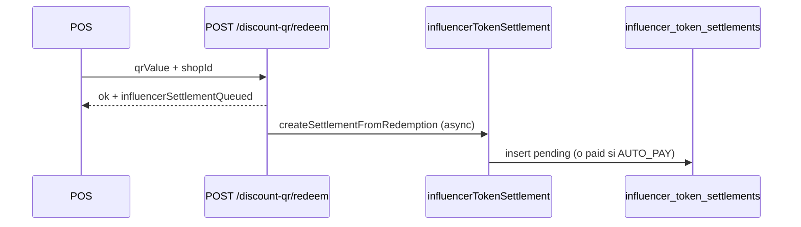

# Abono de tokens al influencer (ledger Mongo)

Sistema para registrar y pagar al **influencer** la comisión por cada **canje de cupón**, usando su **wallet** (`User.blockchain.walletAddress`). Por ahora el “pago” es un **ledger en MongoDB** (`paid` + `txRef` interno); más adelante el mismo modelo puede enlazar `transfer.method: on_chain` y `txRef` = hash.

Relacionado con:

- [APP_INFLUENCER_IDENTITY_AND_STORY_CARDS.md](./APP_INFLUENCER_IDENTITY_AND_STORY_CARDS.md) — wallet + campañas en app
- [POS_BIZNEAI_CUPONES_Y_TRANSFERENCIA_TOKENS.md](./POS_BIZNEAI_CUPONES_Y_TRANSFERENCIA_TOKENS.md) — canje POS (`POST /api/discount-qr/redeem`)

---

## Regla de negocio

| Concepto | Valor |
|--------|--------|
| **1 token = 1 USD** | `amountTokens` = `amountUsd` = comisión por canje |
| **Comisión por canje** | `Bid.amountUsd` para influencer+promoción; si no hay bid, `PromotionApplication.pricing` aprobada; mínimo **1 USD** |
| **Wallet destino** | `payload.walletAddress` del cupón, o wallet del `User` vinculado al influencer |
| **Idempotencia** | Un documento por `couponTokenId` (= `tokenId` del cupón) |

---

## Colección MongoDB

**Modelo:** `server/models/InfluencerTokenSettlement.js`  
**Colección:** `influencer_token_settlements`

| Campo | Tipo | Descripción |
|-------|------|-------------|
| `settlementId` | string | Único, ej. `setl_507f1f77bcf86cd799439011` |
| `influencer` | ObjectId | Ref `influencers` |
| `promotion` | ObjectId | Ref `promotions` |
| `couponTokenId` | string | Único — `discount_qr_tokens.tokenId` |
| `amountUsd` / `amountTokens` | number | Comisión del canje |
| `commissionPerRedemptionUsd` | number | Tarifa usada |
| `walletAddress` | string | Destino del abono |
| `preferredNetwork` | string | ej. `polygon` |
| `status` | enum | `pending` \| `processing` \| `paid` \| `failed` \| `cancelled` |
| `transfer.method` | enum | `mongo_ledger` (actual), `on_chain`, `manual` |
| `transfer.paidAt` | Date | Cuando se marca pagado |
| `transfer.txRef` | string | ej. `mongo-67abc...` o futuro `0x...` |
| `redeemedAt` | Date | Momento del canje |

---

## Variables de entorno (servidor)

| Variable | Default | Descripción |
|----------|---------|-------------|
| `INFLUENCER_SETTLEMENT_ENABLED` | `true` | Si `false`, no crea filas ni expone datos en campañas |
| `INFLUENCER_SETTLEMENT_AUTO_PAY_MONGO` | `false` | Si `true`, al crear abono con wallet válida pasa a `paid` al instante |
| `INFLUENCER_SETTLEMENT_TOKEN_SYMBOL` | `LUXAE` | Símbolo mostrado en app |
| `USD_MXN_RATE` | `18` | Conversión si la comisión viene en MXN en aplicaciones |

---

## Flujo automático (tras canje)



1. POS o app canjea: `POST /api/discount-qr/redeem`
2. Respuesta incluye `influencerSettlementQueued: true` si el módulo está activo
3. En background se crea el abono (no bloquea el canje)

---

## Endpoints app (JWT influencer)

Base: `{API_ORIGIN}/api/influencers`  
Headers: `Authorization: Bearer <token>`

| Método | Ruta | Descripción |
|--------|------|-------------|
| — | (incluido en `POST /app/verify-session`) | `settlements`, `campaigns[].settlement`, `wallet` |
| `GET` | `/app/settlements/summary` | Totales pending/paid y desglose por `promotionId` |
| `GET` | `/app/settlements` | Listado paginado. Query: `page`, `limit`, `status`, `promotionId` |
| `POST` | `/app/settlements/process-pending` | Marca `pending` → `paid` (ledger Mongo) si hay wallet |

Rate limit: mismo bucket que otras rutas `/app/*` (60 / 15 min / IP).

### `POST /app/verify-session` — campos nuevos

```json
{
  "wallet": { "address": "0x...", "preferredNetwork": "polygon" },
  "settlements": {
    "enabled": true,
    "transferMethod": "mongo_ledger",
    "tokenSymbol": "LUXAE",
    "payoutWallet": "0x...",
    "payoutWalletRequired": false,
    "summary": {
      "pendingCount": 2,
      "pendingAmountUsd": 2.4,
      "paidCount": 10,
      "paidAmountUsd": 12,
      "byPromotion": [
        {
          "promotionId": "64promo...",
          "pendingCount": 1,
          "pendingAmountUsd": 1.2,
          "paidCount": 5,
          "paidAmountUsd": 6
        }
      ]
    }
  },
  "campaigns": [
    {
      "shortCode": "K7HN4P2",
      "settlement": {
        "commissionPerRedemptionUsd": 1.2,
        "pendingCount": 1,
        "pendingAmountUsd": 1.2,
        "paidCount": 3,
        "paidAmountUsd": 3.6,
        "tokenSymbol": "LUXAE",
        "transferMethod": "mongo_ledger"
      }
    }
  ]
}
```

### `GET /app/settlements`

Query: `?page=1&limit=20&status=pending&promotionId=64promo...`

Respuesta:

```json
{
  "ok": true,
  "success": true,
  "enabled": true,
  "data": {
    "docs": [
      {
        "settlementId": "setl_...",
        "couponTokenId": "qr_...",
        "promotionId": "64promo...",
        "amountUsd": 1.2,
        "amountTokens": 1.2,
        "walletAddress": "0x...",
        "status": "pending",
        "transfer": { "method": "mongo_ledger", "paidAt": null, "txRef": null }
      }
    ],
    "total": 1,
    "page": 1,
    "limit": 20,
    "totalPages": 1
  }
}
```

### `POST /app/settlements/process-pending`

Body opcional: `{ "limit": 50 }`

Marca como **paid** todos los `pending` del influencer que tengan `walletAddress` (en la fila o en `User` tras `verify-session` / `PATCH /app/wallet`).

```json
{
  "ok": true,
  "data": {
    "processed": 2,
    "failed": 0,
    "results": [
      { "settlementId": "setl_...", "ok": true, "txRef": "mongo-67abc..." }
    ],
    "summary": { "pendingCount": 0, "paidCount": 12, "paidAmountUsd": 14.4 }
  }
}
```

Si falta wallet: `failed` aumenta con `error: "NO_WALLET"`.

---

## Integración en la app móvil

```ts
const API = 'https://www.damecodigo.com';

async function bootstrap(accessToken: string, walletAddress: string) {
  const session = await fetch(`${API}/api/influencers/app/verify-session`, {
    method: 'POST',
    headers: {
      Authorization: `Bearer ${accessToken}`,
      'Content-Type': 'application/json',
    },
    body: JSON.stringify({ walletAddress, preferredNetwork: 'polygon', deviceId: 'uuid' }),
  }).then((r) => r.json());

  const payoutWallet = session.settlements?.payoutWallet;
  const pending = session.settlements?.summary?.pendingAmountUsd ?? 0;

  if (pending > 0 && payoutWallet) {
    await fetch(`${API}/api/influencers/app/settlements/process-pending`, {
      method: 'POST',
      headers: { Authorization: `Bearer ${accessToken}` },
    });
  }

  return session;
}
```

**Recomendación:** siempre enviar `walletAddress` en `verify-session` y al emitir cupones (`POST /discount-qr/codes/:code/issue`) para que cada abono tenga destino claro.

---

## Evolución on-chain

1. Mantener `createSettlementFromRedemption` en `pending`.
2. Worker lee `pending`, firma tx, actualiza `transfer.method: on_chain`, `transfer.txRef: 0x...`, `status: paid`.
3. `POST /app/settlements/process-pending` puede delegar a ese worker o quedar como “confirmación manual” en fase Mongo.

---

## Código fuente

| Pieza | Archivo |
|-------|---------|
| Modelo | `server/models/InfluencerTokenSettlement.js` |
| Lógica | `server/utils/influencerTokenSettlement.js` |
| Hook canje | `server/routes/discountQr.js` (tras `redeem` OK) |
| Rutas app | `server/routes/influencers.js` |
| Controlador | `server/controllers/influencerSettlementController.js` |
| Sesión + campañas | `server/utils/influencerAppSession.js` |

---

## Pruebas rápidas

```bash
TOKEN="<jwt_influencer>"

curl -sS "$API/api/influencers/app/verify-session" \
  -H "Authorization: Bearer $TOKEN" \
  -H "Content-Type: application/json" \
  -d '{"walletAddress":"0x742d35Cc6634C0532925a3b844Bc9e7595f0bEb"}' | jq '.settlements'

curl -sS "$API/api/influencers/app/settlements/summary" \
  -H "Authorization: Bearer $TOKEN" | jq .

curl -sS -X POST "$API/api/influencers/app/settlements/process-pending" \
  -H "Authorization: Bearer $TOKEN" | jq .
```

Tras un canje real en POS, revisar:

```bash
# En mongosh
db.influencer_token_settlements.find({ status: "pending" }).sort({ createdAt: -1 }).limit(5)
```

---

## Checklist producción

- [ ] `INFLUENCER_SETTLEMENT_ENABLED=true` en `.env` del VPS
- [ ] Influencers con `userId` y wallet en app (`verify-session`)
- [ ] Pujas (`bids`) o aplicaciones aprobadas con comisión USD por promoción
- [ ] PM2 reiniciado tras deploy
- [ ] App llama `process-pending` o `INFLUENCER_SETTLEMENT_AUTO_PAY_MONGO=true` si se desea pago instantáneo en ledger
